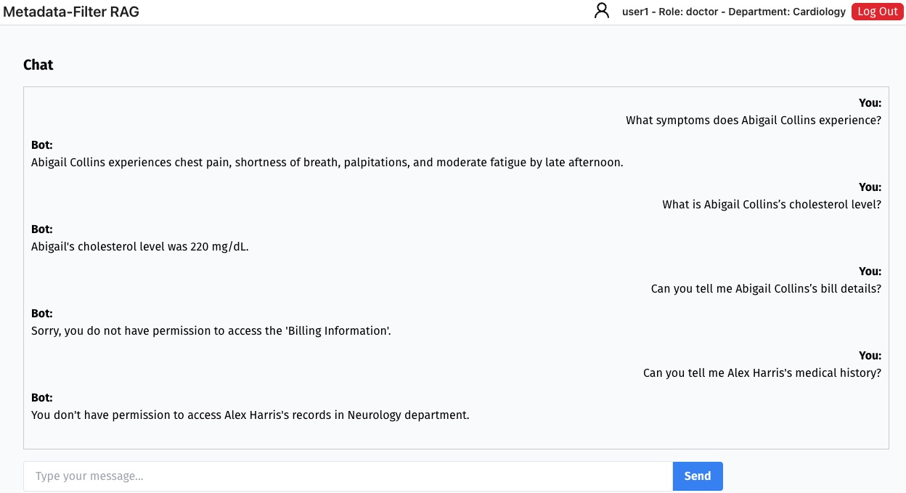
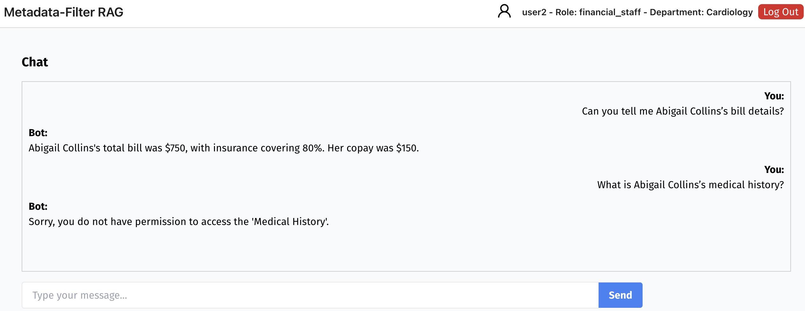

# MetadataFilter RAG PoC System

This project is a Proof-of-Concept (PoC) implementation of a secure and efficient Retrieval-Augmented Generation (RAG) system. It combines **Agent-Driven Metadata Filtering** and **Role-Based Access Control (RBAC)** to improve information retrieval and enforce data access policies in sensitive environments, such as healthcare.


## 🖼️ Demo Screenshot

Here’s a quick look at the system in action:


---

### Key Features
- 🧠 Uses GPT-3.5 for data generating, metadata extraction, and query interpreting.
- 🛡️ Integrates RBAC to limit access to patient records based on user roles.
- 📚 Leverages Qdrant vector database for efficient semantic search.
- ⚙️ Backend: [FastAPI](https://fastapi.tiangolo.com/)
- 🎨 Frontend: [React](https://reactjs.org/)

## 🧠 How It Works

### 🗣️ 1. Understand the User's Query

When a user asks a question, the GPT-3.5 agent analyzes the query to figure out its intent. Common query intents include:
- Basic patient information  
- Current medical condition  
- Ongoing treatment plans  
- Lab results  
- Billing or payment details

### 🔐 2. Filter Based on Permissions

The system builds a secure and accurate filter in three steps:

1. **Retrieve User Permissions**  
   It checks the user's role (e.g., doctor, nurse, billing staff) and allowed data access levels by querying a relational database.

2. **Build a Metadata Filter**  
   GPT-3.5 extracts metadata from the query (e.g., information type, department, patient ID) and combines it with the user's permissions to generate a precise filter.

3. **Search with Metadata Filter**  
   This filter is applied during vector search in Qdrant, so only relevant and authorized documents are retrieved for generating the final answer.


## 🚀 Getting Started
1. Clone the repo:
   ```bash
   git clone https://github.com/bingxiangch/MetaFilterRAG.git
   cd MetaFilterRAG
2. Set up backend:
    ```bash
    python -m venv venv
    source venv/bin/activate  # On Windows: venv\Scripts\activate
    pip install -r requirements.txt
    uvicorn app:app --reload
3. Set up frontend:
    ```bash
    cd frontend
    npm install
    npm start
4. Environment Variables
Before running the backend, make sure you create a `.env` file in the root directory and set the required keys:
    ```bash
    qdrant_url="qdrant_url"
    collection_name="collection_name"
    qdrant_api_key="qdrant_api_key"
    api_key="openai_api_key"

---
## 🛠️ Supporting Scripts

The following Python scripts are included to help generate data, process metadata, load into Qdrant, and evaluate the RAG system.

| Script | Description |
|--------|-------------|
| `generate_mock_patient_records.py` | Creates 100 fake patient records for testing. |
| `patient_record_processor.py` | Extracts metadata using GPT-3.5 and loads records into Qdrant. |
| `generate_eval_dataset.py` | Generates  evaluation data for RAG performance. |
| `ragas_eval.py` | Runs RAGAS to evaluate retrieval and answer quality. |

> 🗂 Output folders:
> - `mock_patient_records/`: Raw patient records  
> - `query_output/`: Evaluation datasets (`generated_qa_pairs.json`, `evaluation_dataset.json`)
