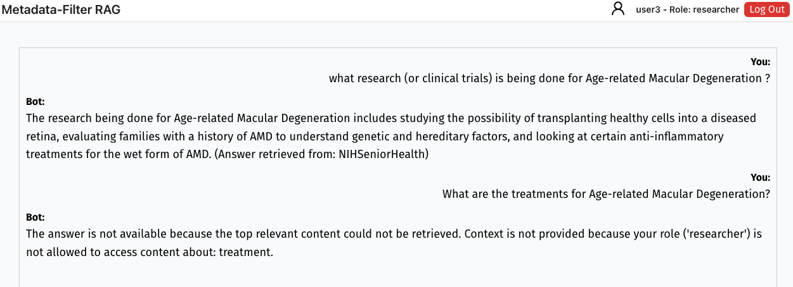

# 🛡️ MetaFilterRAG: Secure Retrieval-Augmented Generation with Access Control

This project is a **Proof-of-Concept (PoC)** system that combines **Retrieval-Augmented Generation (RAG)** with **Role-Based Access Control (RBAC)** using metadata filtering. It ensures that users only retrieve information they are authorized to access — a critical requirement in sensitive domains such as healthcare.

---

## 🖼️ Demo Screenshots

### 👤 Patient View


### 🩺 Doctor View


### 🧪 Researcher View



## 🧠 What It Does

- ✅ Prevents unauthorized access using metadata-based role filtering  
- 📎 Improves retrieval precision by excluding irrelevant context  
- 💬 Ensures that generated answers are both secure and accurate  

---

## ⚙️ System Architecture

The system integrates GPT-3.5 with a vector database (Qdrant), FastAPI backend, and React frontend. It operates in two main phases:

### 📥 Ingestion Phase

1. **Chunking**: Source data (e.g., QA pairs) is broken into smaller retrievable units  
2. **Metadata Extraction**: Fields like `qid` and `qtype` are extracted for fine-grained filtering  
3. **Embedding**: Each chunk is converted into a semantic vector  
4. **Storage**: Vectors and metadata are stored in Qdrant for retrieval

### 🔎 Query Phase

1. **Query Understanding**: GPT-3.5 infers the user’s intent and query `qtype`  
2. **Permission Check**: The system checks the user's role-based access to that `qtype`  
3. **Metadata Filtering**: The vector search is filtered by both semantic similarity and role permissions  
4. **Answer Generation**: GPT-3.5 generates an answer from only the authorized and relevant context


---

## 🔐 Role-Based Access Control (RBAC)

Each user is assigned a role that limits their access to certain medical topics. Access is enforced before retrieval, not just before generation.

| Role        | Allowed Access Types (`qtype`) Example |
|-------------|----------------------------------------|
| Patient     | information, prevention, support groups, considerations |
| Doctor      | symptoms, treatment, exams and tests, stages, etc. |
| Researcher  | research, causes, genetic changes, outlook |
| Admin       | Unrestricted access |

---

## 🚀 Getting Started

### 1. Clone the Repo
```bash
git clone https://github.com/bingxiangch/MetaFilterRAG.git
cd MetaFilterRAG
```
### 2. Backend Setup

```bash
python -m venv venv
source venv/bin/activate  # On Windows: venv\Scripts\activate
pip install -r requirements.txt
uvicorn app:app --reload
```

### 2. Frontend Setup

```bash
cd frontend
npm install
npm start
```


### 2. Set Environment Variables

```bash
qdrant_url=your_qdrant_url
collection_name=your_collection_name
qdrant_api_key=your_qdrant_api_key
api_key=your_openai_api_key
```

## 🛠 Supporting Scripts

The following scripts are provided to support data loading, metadata processing, and evaluation:

| Script Name                     | Description |
|--------------------------------|-------------|
| `medquad_ingest.py`            | Loads the MedQuAD dataset into the Qdrant vector database after embedding each QA pair and attaching metadata such as `qtype` and `qid`. |
| `sample_medquad_qa_subset.py`         | Randomly selects 500 question–answer pairs from the MedQuAD dataset for evaluation purposes. |
| `prepare_eval_dataset.py`     | Generates evaluation data by sampling queries and structuring them into test-ready format. |
| `ragas_eval.py`                | Runs RAGAS (Retrieval-Augmented Generation Evaluation Toolkit) to measure context precision and answer correctness. |

## 📂 Dataset Files

The project uses a curated version of the **MedQuAD** dataset stored in the `MedQuAD/` folder, along with evaluation-ready files:

- `medquad_qa_subset_500.json`: A randomly sampled subset of 500 QA pairs used for benchmarking.
- `rag_eval_dataset_medquad.json`: Structured evaluation data used to compare baseline vs. filtered RAG systems.